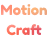

#  MotionCraft: Experimental UI Website

**MotionCraft** is an experimental UI experiments website where I explore and experiment with a variety of UI animations and engineering components. This project is a series of interactive and innovative UI designs, created using **Framer**, **React**, and **Tailwind CSS**. Each experiment focuses on pushing the boundaries of user experience through motion and interaction design.

## Project Overview

MotionCraft is a collection of UI experiments, ranging from micro-interactions to complex animations, all aimed at enhancing the user experience. The goal is to explore creative solutions for real-world UI challenges and prototype engaging and responsive interfaces.

### Technologies Used:

- **Framer**: For rapid prototyping and creating smooth, interactive animations.
- **React**: The core framework for building reusable UI components.
- **Tailwind CSS**: For styling with utility-first CSS, ensuring responsive design.
